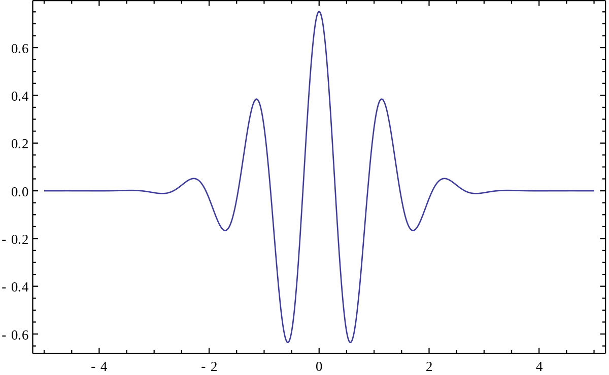

```{r setup, include = FALSE}
knitr::opts_chunk$set(warning = FALSE, message = FALSE)
ggplot2::theme_set(ggplot2::theme_minimal())
```

```{r include=FALSE}
library(tidyverse)
library(WaveletComp)
```

Na naszym ostatnim spotkaniu Tomek pokazywał wykresy z falek z których wynikało, że jest taki przedział CSI w którym wydaje się że jest sprzężenie (i to istotne statystycznie).

```{r results=FALSE}
# load data
low_data_dir <- "../../data/low_resolution"
high_data_dir <- "../../data/high_resolution"
low_files <- dir(low_data_dir, patter = "*.csv$")
high_files <- dir(high_data_dir, patter = "*.csv$")

low_data <- low_files %>%
  map(~ read_csv(file.path(low_data_dir, .), show_col_types = F)) %>%
  reduce(rbind)

high_data <- high_files %>%
  map(~ read_csv(file.path(high_data_dir, .), show_col_types = F)) |>
  reduce(rbind)

# high res data gathered in 4 sessions encoded PARTID + S1-S4. S1-S4 removed
high_data <- high_data |> 
              mutate(PART_ID = str_sub(PART_ID, 1, nchar(PART_ID)-2))
```


```{r eval=FALSE, include=FALSE}
str(high_data)
```

## Dane surowe (high freq)

```{r fig.width=12}
high_data %>%
  group_by(PART_ID, CSI) %>%
  summarise(mean = mean(Corr)) %>%
  ggplot(mapping = aes(x = CSI, y = mean)) +
  geom_line() +
  facet_wrap(~PART_ID)
```

## Teoria 

Transformata fouriera działa tak, że bierzemy sobie sygnał i rozbijamy go na sumę cosinusów o różnej częstotliwości i fazie.
Wiemy też, że transformata fouriera działa w obie strony - na zbiorze cosinusów możemy zrobić transformatę odwrotną inverse-FFT i dostajemy sygnał oryginalny.
Z kolei z falkami jest tak, że zamiast cosinusów mamy jedną funkcję bazową, najpopularniejszym wyborem jest falka morleta;
{width=50%}

(Formalnie to trzeba by było pamiętać, że tam jest komponent rzeczywisty i urojony, ale dla wywodu to nie ma znaczenia)


No i transformata falkowa to jest takie zwierze, że bierze tyle takich falek morleta ile potrzebuje i każdą z nich rozciąga/ściska a następnie przesuwa po osi x. Czyli tak jak wynikiem Fouriera jest zbiór współczynników jak przeskalować (jaką amplitudę nadać) i jak przesunąć w fazie (ale o tym na potrzebę wywodu zapominamy, bo to część urojona) kolejne cosinusy, to wynikiem falek jest recepta jak pougniatać i przeciągać po osi x ileś tam kopii funkcji bazowej.

No i tutaj się pojawia sanity-check w postaci rekonstrukcji sygnału. Jest to nic innego jak zrobienie odwrotnej transformaty falkowej na tym zbiorze pogniecionych i przesuwanych falek w celu uzyskania oryginalnego sygnału. 

I to właśnie widać na wykresach poniżej.

## Wykresy

Przepraszam, że zostawiam brzydko opisane ośki. Biblioteka która rysuje te falki średnio ze mną współpracuje 
i uznałem, że użeranie się z nią nie ma sensu. 

Dla każdego badanego mamy trzy wykresy, kolejno:

1. Widmo czasowo-częstościowe

* oś X to kolejne punkty danych, czyli ten nasz przedział 300-900 ms czy jakoś tak. 
* oś Y - długość okresu czyli 1/Hz skala logarytmiczna 0.25 to 4 Hz 0.125 to 8 Hz 0.0625 to 16 Hz 0.03125 to 32 Hz
* Białą obwolutą zaznaczone są obszary istotne statystycznie

2. Falki

Poszczególne falki dopasowane do sygnału. Warte uwagi jest to, że (1) jest ich relatywnie niewiele (2) są duże obszary
pustki, co oznacza, że aproksymujemy zerem. 

3. Wynik rekonstrukcji falek nałożony na oryginalny sygnał. 

Widać, że te rekonstrukcje są kiepskie, co oznacza, że dopasowanie falek jest równie złe. 

**Insight**: Właściwie wszystkie wykresy mają obszary istotne statystycznie, zgodnie z wynikami Tomka. Są one jednak rozmieszczone dość chaotycznie.

**Insight**: Ta istotność statystyczna wychodzi być może z porównywania obszarów gdzie amplituda dopasowanych falek jest w miare duża, do obszarów, w których nie dopasowano niczego. Z porównania wykresów widm do rekonstrukcji widać, że istotnie jest tam, gdzie jest peak falki. 

**Insight**: Te "wyspy istotności statystycznej" są bardzo niestabilne numerycznie. Wystarczy lekko zmienić skale osi X (nawet na wielokrotność) i wynik jest zupełnie inny. Gdyby te efekty były realne, to zmiana parametru próbkowania
nie powinna wiele zmieniać, co najwyżej zakłamywać odczyt lokalizacji z wykresu, tutaj natomiast po zmianie parametru, 
"wyspy" pojawiają się zupełnie gdzie indziej. To również sugeruje, że istotność może wychodzić z numerycznych błędów
przy porównywaniu do zera.

```{r results=FALSE}

part_ids <- high_data |> select(PART_ID) |> unique()
part_ids <- part_ids$PART_ID

# params
detrend = FALSE
sampling = 120
low_freq_band = 4
upper_freq_band = 32

for (pid in part_ids) {
  w <- high_data |>
    filter(Trial_type == "experiment", PART_ID == pid) |>
    group_by(CSI) |>
    summarise(mean = mean(Corr)) |>
    analyze.wavelet(
      "mean",
      loess.span = detrend,
      dt = 1 / sampling,
      lowerPeriod = 1 / upper_freq_band,
      upperPeriod = 1 / low_freq_band,
      make.pval = TRUE,
      n.sim = 10
    )
  
  wt.image(
    w,
    color.key = "quantile",
    main = pid,
    n.levels = 100,
    legend.params = list(lab = "wavelet power levels", mar = 4.7)
  )
  
  reconstruct(
    w,
    plot.waves = TRUE,
    lwd = c(1, 2),
    legend.coords = "bottomleft",
    main = pid
  )
}
```
