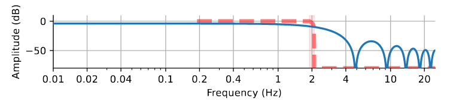
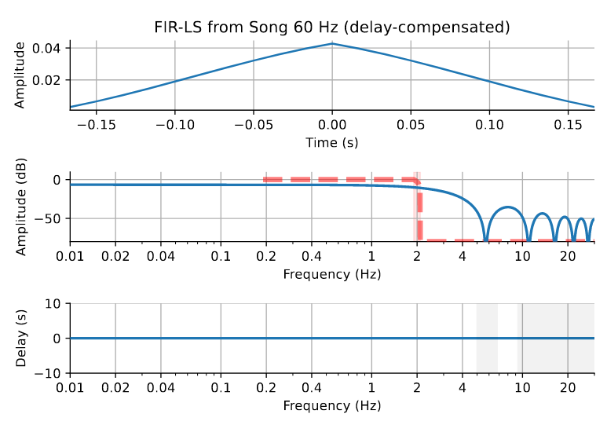
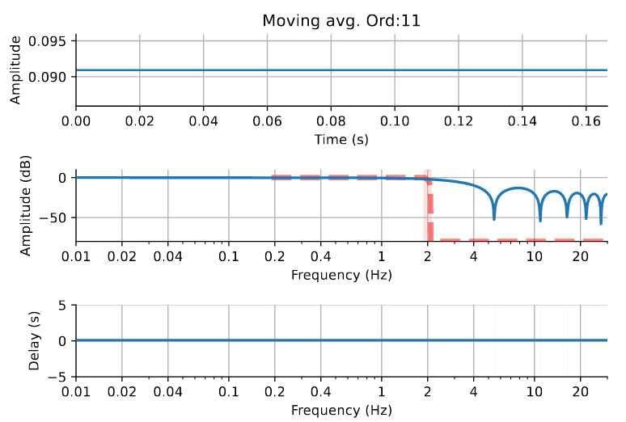

```{r setup, include=FALSE}
knitr::opts_chunk$set(echo = TRUE)
library(reticulate)
use_python("/opt/miniconda3/envs/py_mne_env/bin/python")
matplotlib <- import("matplotlib", convert = TRUE)
matplotlib$use("TkAgg")
```


```{python imports, include=FALSE}
import os
import random
import numpy as np
from scipy import signal
import pandas as pd
from os.path import join
import matplotlib.pyplot as plt
from mne.viz import plot_filter
```


# @Song2014 Lowpass (0~2 Hz)

W tekscie  stoi:

**Filtering analysis.**
_"To investigate the RT profiles within different frequency bands, the RT temporal profile for each condition (valid vs invalid for LVF, valid vs invalid for RVF) was zero-padded (50 points before and after the RT temporal profile), multiplexed by a Hanning window, and then filtered (two-pass least-squares FIR filtering, 10th order, EEGLAB toolbox) within different cutoff frequency bands (0–2,2–5, and 8–20 Hz), in each subject separately."_  

**Insight**: Song stosuje dość szczególny filtr i dlatego to w ogóle działa. 

Będąc precyzyjnym: filtr jest normalny, szczególna jest natomiast metoda doboru parametrów. 
Filtrowi zadaje się przedział charakterystyki częstotliwościowej, w którym ma on działać 
możliwie blisko teoretycznego ideału.

Konkretnie: odległość (liczona metoda najmniejszych kwadratów) pomiędzy filtrem idealnym 
(zaznaczonym na poniższym wykresie czerwoną przerywaną linią) a filtrem dopasowanym 
(niebieska ciągła linia) w optymalizowanym przedziale (przeźroczysto czerwony, mało widoczny,
bo zadany jako 1.9 Hz 2.1 Hz) ma być minimalna. 

```{python eval=TRUE, include=FALSE}
song_sfreq = 50  
cutoff = 2.0
flim = (.01, song_sfreq / 2.)  # limits for plotting
nyq = song_sfreq / 2.0 # Nyquist freq
freq = [0, cutoff - 0.1, cutoff + 0.1, nyq]
gain = [1, 1, 0, 0]

song_order = 11
song_filter = signal.firls(song_order, freq, gain, fs=song_sfreq)
song_filter_eff = np.convolve(song_filter, song_filter[::-1])
```

```{python eval=FALSE, include=FALSE}
plot_filter(song_filter_eff, song_sfreq, freq, gain, title = "FIR-LS from Song",
           flim=flim, compensate=True)
```



Ważna uwaga: Nie ma pewności, że filtr u Songa wyglądał dokładnie tak samo. Song nie podaje, na jakim przedziale optymalizuje najmniejsze kwadraty (ja zakładam 1.9-2.1 Hz).
Jaki by to jednak przedział nie był wynik będzie podobny, a konkretnie: podobnie kiepski.


Co więcej, FIRLS to filtry typu "linear phase", co oznacza, że faza poszczególnych składowych
ulega po ich użyciu liniowemu przesunięciu. To oczywiście nie jest dobrze, ale jest na to 
standardowe lekarstwo, którego używa Song. Filtr aplikuje się dwa razy, najpierw normalnie,
a następnie "od końca" (odwrotność filtra aplikuje się od końca do początku sygnału. Nazywa się to 
forward-backward filteringiem, a zwykle implementuje funkcją filtfilt. 
W ten sposób liniowe przesunięcia się znoszą. Mnoży to jednak wszystkie zniekształcenia razy dwa
i potencjalnie **tworzy dodatkową okazję do pojawienia się artefaktów w wynikowym sygnale**. 
Poprawia też parametry filtra (na powyższym wykresie widać już działanie filtra zaaplikowanego dwa
razy)

**Insight**: Używanie forward-backward filteringu może jeszcze bardziej pogarszać sytuację z 
artefaktami. 

Co ciekawe, w 2013 roku two-pass least-squares FIR filter był domyślnym filtrem w MATLAB EEGLAB 
TOOLKIT, którego używa Song. Dziś ten filtr nie jest już rekomendowany:
_"response onset latency was smeared out in time for several tens or even hundreds of milliseconds in a simulated dataset"_

Dyskusja (w kontekście sygnału EEG) opisana jest w [@Widmann2012].

**Insight**: Rekomendowane (defaultowe) dziś filtry (w EEGLAB i nie tylko) nie wyplują sensownego filtra
dla zadanych u Songa parametrów. Prawdopodobnie dlatego Tomasz miał problem z odtworzeniem
filtra Songa.

**Insight**: Nie wiemy, czy Song wybrał świadomie, czy mu się poszczęściło.

**Insight**: Badacze wzorujący się na Songu w bezrefleksyjny sposób (biorący domyślny filtr EEGLAB)
mogli dostawać zupełnie inne wyniki, bo algorytm filtrowania pod tą funkcją w toolkicie się
zmienił. 

**Tomku**, gdybyś chciał pokesperymentować z tym filtrem, to dla wygody zamieszczam jego 
wspołczynniki beta:

```{python echo=FALSE}
song_filter
```


# Filtr @Song2014 na naszych danych 

Postanowiłem sprawdzić, jak podejście Songa zadziała na naszych danych. 
Dla kompletności wywodu zestawiam je również ze średnią kroczącą o takiej samej 
jak filtr Songa długości. 

## Helpers

```{python}
moving_avg = lambda x, k: np.convolve(x, np.ones(k)/k, mode = "same")
reverse = lambda x: x[::-1]

low_sfreq = 60
high_sfreq = 120
song_order = 11
nyq = low_sfreq / 2.0 # Nyquist freq
flim = (.01, low_sfreq / 2.)  # limits for plotting
cutoff = 2.0
freq = [0, cutoff - 0.1, cutoff + 0.1, nyq] # transitions bands 
gain = [1, 1, 0, 0] # gain (and attenuation) in band
```

## Data import

Ładuje oba zbiory danych, ale wyniki prezentuje tylko dla niższej częstotliwości próbkowania.

```{python load_data}
main_dir = join(os.path.expanduser("~"), "Projects", "Behavioral-oscillations", "data")
low_data_dir = join(main_dir, "low_resolution")
high_data_dir = join(main_dir, "high_resolution")

# import data (one randomly selected participant)
low_part = random.choice(os.listdir(low_data_dir))
high_part = random.choice(os.listdir(high_data_dir))

low_data = pd.read_csv(join(low_data_dir, low_part))
high_data = pd.read_csv(join(high_data_dir, high_part))

low_data = low_data.groupby('CSI').mean().Corr.to_list()
high_data = high_data.groupby('CSI').mean().Corr.to_list()

```

U Songa próbkowano 50 Hz, a my próbkowaliśmy 60 Hz więc filtr będzie się nieznacznie różnić.


```{python eval=FALSE, include=TRUE}
song_filter = signal.firls(song_order, freq, gain, fs=low_sfreq)
song_filter_eff = np.convolve(song_filter, reverse(song_filter)) 

plot_filter(song_filter_eff, low_sfreq, freq, gain, title = f"FIR-LS from Song {low_sfreq} Hz",
            flim=flim, compensate=True)

```


Tak natomiast wygląda charakterystyka średniej kroczącej o długości równej filtra Songa

```{python eval=FALSE, include=TRUE}
plot_filter(np.ones(song_order)/song_order, low_sfreq, freq, gain,
            title = f"Moving avg. Ord:{song_order}", flim=flim, compensate=False)

```


### Dane po przefiltrowaniu 

```{python}

# forward-backward filtering
song_filtered = reverse(np.convolve(reverse(np.convolve(song_filter, low_data)), song_filter))
# abbrivied part of signal removed
song_filtered = song_filtered[len(song_filter) - 1:-len(song_filter) - 1]

fig, ax = plt.subplots()
ax.plot(low_data, label = "Original")
ax.plot(moving_avg(low_data, song_order), label = f"Moving avg. Ord:{song_order}")
ax.plot(song_filtered, label = f"Song FIR-LS")

ax.set_xlabel('CSI [ms]')
ax.set_ylabel('Acc [0-100%]')
ax.legend()
ax.set_title("Efekty filtrowania pomiędzy moving-avg a Song drastycznie się różnią")
ax.set_xticks([0, 10, 20, 30, 40], [216, 383, 550, 716, 883])
fig.show()
plt.show()
```

**Insight**: Wynik filtrowania Moving-avg a FIR-LS różnią się bardziej niż przypuszczałem.
Otwarte pozostaje pytanie, czy ta metoda tworzy artefakty czy nie. 

# Źródła

